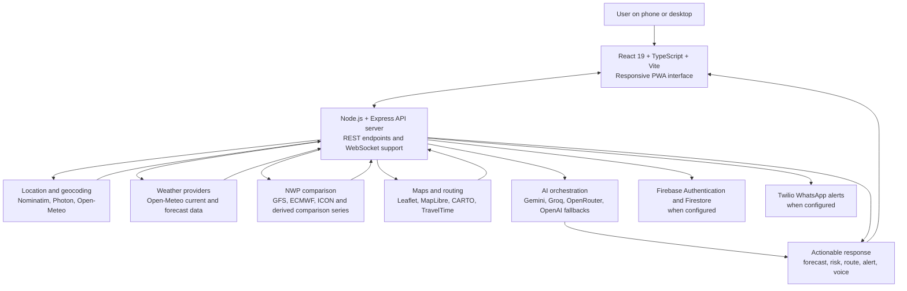
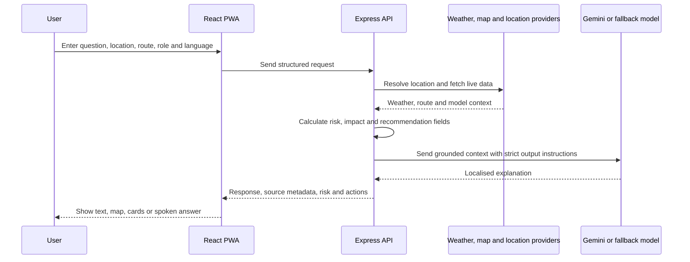

# 🌦️ WeatherGPT

### Conversational weather intelligence and route-aware decision support for India

[](https://react.dev/)
[](https://www.typescriptlang.org/)
[](https://vite.dev/)
[](https://expressjs.com/)
[](https://ai.google.dev/)
[](LICENSE)

WeatherGPT turns live weather information into practical answers for citizens, travellers, commuters, farmers, and event planners. A user can ask a question by text or voice, select a language and location, compare weather models, analyse a route, and receive an explanation with recommended actions.

The application is designed around one principle:

> Weather data should lead to a clear decision, not only a number on a dashboard.

## Contents

- [What the application does](#what-the-application-does)
- [Why it is useful](#why-it-is-useful)
- [Architecture](#architecture)
- [Request and decision flow](#request-and-decision-flow)
- [Feature status](#feature-status)
- [Technology stack](#technology-stack)
- [Repository structure](#repository-structure)
- [Local setup](#local-setup)
- [Environment variables](#environment-variables)
- [API surface](#api-surface)
- [Data credibility and limitations](#data-credibility-and-limitations)
- [Deployment](#deployment)
- [Demo flow](#demo-flow)
- [Roadmap](#roadmap)
- [References](#references)

## What the application does

### Conversational weather assistant

Users can ask questions such as:

- “Will it rain in Delhi today?”
- “Is it safe to travel from Delhi to Shimla this morning?”
- “Should I irrigate my crop today?”
- “What precautions should I take during a thunderstorm?”

The server first collects structured weather context. The AI layer then explains that context in the selected language and user persona. The model is not intended to invent weather observations.

### Route-aware weather intelligence

The route experience supports:

- origin and destination selection;
- route geometry and travel-time estimates;
- weather checkpoints along a route;
- route risk indicators;
- departure-window comparison;
- nearby places such as hospitals, petrol pumps, cafés, restaurants, and sheltered stops;
- map-based route and weather visualisation.

### Multilingual and voice interaction

The application contains a language prompt catalogue for English, Hinglish, and Indian languages. Text responses use the selected language instruction. Voice capabilities depend on the configured Gemini service and the voice packs available in the user’s browser or device.

### Numerical weather model comparison

The NWP view compares model-shaped forecast series such as:

- NOAA GFS;
- ECMWF IFS;
- DWD ICON;
- a multi-model consensus;
- a WRF-labelled regional comparison series.

See [Data credibility and limitations](#data-credibility-and-limitations) for the important distinction between external model data and locally derived comparison values.

### Alerts and WhatsApp delivery

The project includes an alert-evaluation path and a Twilio WhatsApp service. When Twilio credentials and approved sender configuration are present, the server can evaluate configured thresholds and send alert messages. Without those credentials, the feature remains unavailable and should be shown as unavailable rather than as active.

## Why it is useful

Traditional weather products often make the user interpret several unrelated values. WeatherGPT combines those values with location, route, time, and user role to answer a practical question:

```text
Raw forecast data
        ↓
Location and route context
        ↓
Risk and impact interpretation
        ↓
Plain-language recommendation
        ↓
Text or voice response in the user’s language
```

This is decision support. It does not replace official warnings, emergency services, or professional meteorological advice.

## Architecture



### Layer responsibilities

| Layer | Responsibility |
|---|---|
| Presentation | React screens, map controls, chat, voice controls, loading states, and responsive layouts |
| Client services | Location, map, trip, NWP, climate, service-worker, and WhatsApp client modules |
| API server | Express routes, request validation, provider orchestration, WebSocket handling, and secret protection |
| Weather layer | Live Open-Meteo requests, caching, weather-code interpretation, and forecast context |
| Model layer | Multi-model forecast retrieval, comparison summaries, divergence indicators, and consensus values |
| AI layer | Gemini prompt construction and fallback model cascade |
| Persistence | Firebase Authentication and Firestore when the project is configured for them |
| Communications | Twilio WhatsApp delivery when credentials and sender approval are available |

## Request and decision flow



## Feature status

The table below keeps the README honest about what requires provider configuration.

| Capability | Code path or provider | Status |
|---|---|---|
| Live current weather | `server.ts` and Open-Meteo | Implemented with cache and fallback handling |
| Location search | Nominatim, Photon, Open-Meteo geocoding | Implemented with fallbacks |
| Conversational assistant | `/api/chat`, Gemini and model cascade | Implemented; AI keys are required for full model responses |
| Indian-language response prompts | `GLOBAL_LANGUAGE_PROMPT_MAP` | Implemented; output quality depends on the selected model |
| NWP comparison endpoint | `/api/weather/nwp-models` | Implemented through Open-Meteo multi-model data |
| Native WRF simulation | Separate WRF/WPS compute pipeline | Not currently implemented |
| Route weather analysis | `/api/route/analyze` and trip services | Implemented where route/provider data is available |
| Map display | Leaflet, MapLibre, CARTO configuration | Implemented; provider keys may be optional |
| Firebase auth and Firestore | Firebase configuration files and client package | Available when Firebase is configured |
| WhatsApp warnings | `server/twilioWhatsAppService.ts` | Optional; requires Twilio credentials and approved sender |
| Offline PWA behaviour | `serviceWorker.ts`, cache storage, manifest | Implemented as a client capability; offline coverage should be tested per release |

## Technology stack

| Area | Technologies |
|---|---|
| Frontend | React 19, TypeScript, Vite 6 |
| Styling and motion | Tailwind CSS v4, Motion, Lucide React |
| Mapping | Leaflet, MapLibre GL, CARTO basemaps |
| Backend | Node.js, Express 4, TypeScript, `tsx`, `ws` |
| AI | `@google/genai`, Gemini 2.5 Flash, Gemini Live integration, optional Groq/OpenRouter/OpenAI cascade |
| Weather | Open-Meteo current and forecast APIs, multi-model fields where available |
| Geocoding | Nominatim, Photon, Open-Meteo geocoding fallback |
| Persistence | Firebase Authentication and Cloud Firestore |
| Messaging | Twilio WhatsApp Business API |
| PWA | Service Worker API, Cache Storage API, Web App Manifest |

## Repository structure

```text
weather-gpt--anmol/
├── public/                         # Static assets and public app files
├── src/
│   ├── components/                 # Screens and reusable UI components
│   ├── context/                    # Shared application state
│   ├── data/                       # Static catalogues and application data
│   ├── hooks/                      # Reusable React hooks
│   ├── lib/                        # Firebase and shared libraries
│   ├── services/                   # Weather, maps, NWP, trips, PWA, alerts
│   ├── utils/                      # Browser and formatting helpers
│   ├── App.tsx                     # Application shell and navigation
│   ├── main.tsx                    # React entrypoint
│   ├── index.css                   # Global styles
│   └── types.ts                    # Shared TypeScript contracts
├── server/
│   ├── aiModelCascade.ts           # AI provider fallback orchestration
│   └── twilioWhatsAppService.ts    # WhatsApp alert integration
├── server.ts                       # Express server, API routes and WebSockets
├── .env.example                    # Environment variable template
├── firebase-applet-config.json     # Firebase app configuration
├── firebase-blueprint.json         # Firebase project blueprint
├── firestore.rules                 # Firestore access rules
├── package.json                    # Scripts and dependencies
└── README.md                       # Project documentation
```

## Local setup

### Prerequisites

- Node.js 20 or newer is recommended
- npm 9 or newer
- A Gemini API key for AI responses
- Optional provider accounts for Firebase, CARTO, TravelTime, Twilio, Groq, OpenRouter, or OpenAI

### Install and run

```bash
git clone https://github.com/sk91-byte/weather-gpt--anmol.git
cd weather-gpt--anmol
npm install
```

Create a local environment file:

```bash
cp .env.example .env
```

On Windows PowerShell:

```powershell
Copy-Item .env.example .env
```

Add the required values to `.env`, then start the development server:

```bash
npm run dev
```

Open [http://localhost:3000](http://localhost:3000).

### Production build

```bash
npm run lint
npm run build
npm start
```

The `build` script creates the Vite frontend bundle and bundles the server entrypoint into `dist/server.cjs`.

## Environment variables

Copy `.env.example` and configure only the providers you intend to use.

| Variable | Purpose | Required |
|---|---|---|
| `GEMINI_API_KEY` | Gemini chat, grounding, and voice-related capabilities | Required for full AI functionality |
| `APP_URL` | Public application URL used for hosted callbacks and links | Required in hosted deployments |
| `CARTO_MAPS_API_KEY` | CARTO map resources where the selected map configuration needs it | Optional |
| `TRAVELTIME_APP_ID` | TravelTime geospatial routing/search integration | Optional |
| `TRAVELTIME_API_KEY` | TravelTime authentication | Optional |
| `TWILIO_ACCOUNT_SID` | Twilio account identity | Optional |
| `TWILIO_AUTH_TOKEN` | Twilio server credential | Optional |
| `TWILIO_WHATSAPP_FROM` | Approved Twilio WhatsApp sender | Optional |
| `TWILIO_CONTENT_SID` | Optional WhatsApp template identifier | Optional |
| `GROQ_API_KEY` | Groq fallback model provider | Optional |
| `OPENROUTER_API_KEY` | OpenRouter fallback provider | Optional |
| `OPENAI_API_KEY` | OpenAI-compatible fallback provider | Optional |
| `OPENAI_BASE_URL` | Custom OpenAI-compatible endpoint | Optional |

Never commit `.env`, API keys, access tokens, or service-account files.

## API surface

The main server routes include:

| Method | Endpoint | Purpose |
|---|---|---|
| `GET` | `/api/health` | Check server availability and AI configuration status |
| `GET` | `/api/weather/current` | Return current weather for a location |
| `GET` | `/api/weather/search-location` | Search and resolve an Indian location |
| `GET` | `/api/weather/nwp-models` | Return cached multi-model forecast comparison data |
| `POST` | `/api/chat` | Generate a grounded, role-aware weather response |
| `POST` | `/api/route/analyze` | Analyse weather exposure along a route |
| `POST` | `/api/route/best-time` | Compare departure windows |
| `GET` | `/api/climate/history` | Request historical or climate context where supported |
| `POST` | `/api/alerts/*` | Alert evaluation and delivery routes exposed by the server when configured |

The alert route names are maintained in `server.ts` and the Twilio service module. Keep this table synchronized when adding or renaming an endpoint.

The exact request and response contracts should be kept in sync with `server.ts` and the TypeScript types in `src/types.ts`.

## Data credibility and limitations

### What is live

The application requests live weather and geocoding data from configured public providers. Provider status and timestamps should be displayed to users so they can distinguish a live response from a cached or unavailable response.

### What requires credentials

Gemini, Firebase, TravelTime, CARTO, Twilio, and fallback LLM providers require configuration. The application cannot claim that a provider is active when its credentials are missing or the request failed.

### Important NWP clarification

The current `/api/weather/nwp-models` implementation obtains GFS, ECMWF, ICON, and related model fields through the Open-Meteo multi-model API. Its WRF-labelled series is derived locally from available model values and heuristic adjustments. It is **not** the output of a native WRF/WPS run.

For scientific or operational use, a future WRF integration should run WRF separately with real boundary conditions, store the resulting NetCDF output, and expose the run timestamp, domain, resolution, and provenance through the API.

### AI safety boundary

AI should explain structured provider data. It should not create official warnings, invent measurements, or replace IMD, NDMA, emergency services, or local authority instructions. Any fallback values used for development must be labelled clearly in the UI and API metadata.

## Deployment

The application is a Node.js/Express service that can be deployed to a Node-compatible platform such as Render, Railway, Fly.io, or a managed container service.

Typical production commands:

```bash
npm ci
npm run build
npm start
```

Configure the environment variables in the hosting provider’s secret manager. Do not place private keys in frontend code or commit them to GitHub.

Before a production release, verify:

1. `GET /api/health` returns the expected status.
2. The frontend can reach the deployed API origin.
3. Live provider timestamps are current.
4. Missing providers show “unavailable” rather than fabricated results.
5. Twilio test delivery is disabled unless the sender and recipient flow is approved.
6. Firebase rules allow only the intended authenticated operations.

## Demo flow

Use this sequence for a clear demonstration:

```text
Open WeatherGPT
      ↓
Choose or search a location
      ↓
Show current weather and forecast
      ↓
Ask a weather question in text
      ↓
Switch the language and ask a follow-up
      ↓
Demonstrate voice interaction
      ↓
Open a route and inspect weather checkpoints
      ↓
Compare NWP model summaries
      ↓
Show the departure-time recommendation
      ↓
Open route risk and nearby-place information
      ↓
Demonstrate an alert only when an official/configured source is available
```

## Roadmap

### Near term

- Add automated integration tests for every provider adapter.
- Add explicit `source`, `is_live`, `is_cached`, and `is_demo` fields to every weather response.
- Replace heuristic fallback values with clearly labelled unavailable states.
- Add route-risk test fixtures for rain, fog, heat, and severe-weather cases.
- Document Firebase authentication and Firestore security rules.

### Research and production extensions

- Run a real WRF/WPS regional forecast pipeline outside the web request path.
- Add official IMD and NDMA alert adapters with source links and validity windows.
- Add model-run provenance and forecast verification metrics.
- Add low-connectivity and offline emergency guidance.
- Add opt-in WhatsApp and push notifications with user-controlled thresholds.
- Add consent, retention, and audit documentation for location and notification data.

## References

- [Open-Meteo API documentation](https://open-meteo.com/en/docs)
- [India Meteorological Department](https://mausam.imd.gov.in/)
- [NDMA SACHET](https://sachet.ndma.gov.in/)
- [Google Gemini API](https://ai.google.dev/gemini-api/docs)
- [React](https://react.dev/)
- [Vite](https://vite.dev/)
- [Express](https://expressjs.com/)
- [Leaflet](https://leafletjs.com/)
- [MapLibre GL JS](https://maplibre.org/maplibre-gl-js/docs/)
- [Firebase](https://firebase.google.com/docs)
- [Twilio WhatsApp API](https://www.twilio.com/docs/whatsapp)
- [WRF official repository](https://github.com/wrf-model/WRF) for future native regional modelling work

## Team and license

**Team:** Add the final team name and member responsibilities here.

**Problem statement:** Smart India Hackathon 2026, WeatherGPT / conversational weather intelligence.

This repository is licensed under the Apache License 2.0. See [LICENSE](LICENSE).

## Project vision

> Make weather intelligence understandable, verifiable, multilingual, and actionable for every user.
