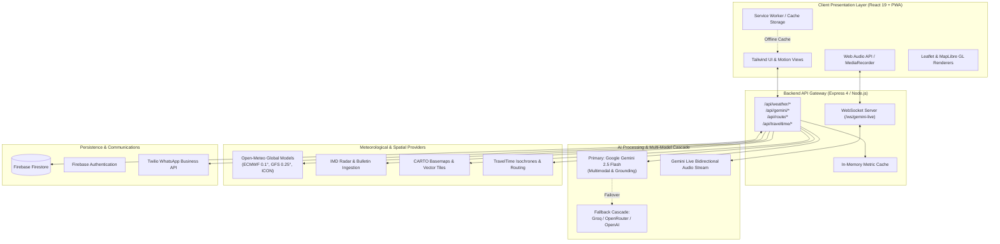

# 🌤️ Weather GPT — Intelligent Decision-Support & Multilingual Climate Intelligence

[](https://sih.gov.in)
[](LICENSE)
[](https://react.dev/)
[](https://www.typescriptlang.org/)
[](https://nodejs.org/)
[](https://ai.google.dev/)
[](https://firebase.google.com/)
[](https://tailwindcss.com/)
[](https://web.dev/progressive-web-apps/)

> **"Don't Just Know the Weather. Know What to Do."**  
> An enterprise-grade, conversational climate intelligence platform combining high-resolution Numerical Weather Prediction (NWP) models, real-time Google Search/Maps grounding, turn-by-turn route risk forecasting, and proactive WhatsApp push alerts for rural and urban India.

---

## 📌 1. Overview / Abstract

### The Problem
Traditional meteorological tools, national dashboards, and consumer weather apps suffer from severe usability and cognitive friction:
1. **Raw Numerical Overload**: Barometric charts, dew-point tables, and millimeter precipitation graphs overwhelm citizens, farmers, and daily commuters who only need answers to pragmatic questions: *"Can I spray pesticide on my cotton crop today?"*, *"Will highway flooding disrupt my commute to Pune?"*, or *"Is it safe for an outdoor wedding tonight?"*
2. **Linguistic Exclusion**: Over 70% of India's agrarian workforce relies on regional languages (Hindi, Marathi, Punjabi, Tamil, Telugu, Bengali), whereas standard weather alerts remain predominantly in formal English.
3. **Passive Observation vs. Active Guidance**: Existing systems passively report the temperature; they do not optimize departure schedules, analyze dynamic highway weather threats, or issue proactive warnings directly through common communication channels like WhatsApp.

### The Solution: Weather GPT
**Weather GPT** transforms raw multi-source atmospheric data into instant, context-aware decisions. Powered by **Google Gemini 2.5 Flash** with multi-model fallback cascading (Groq, OpenRouter, OpenAI), the system delivers:
- Multi-turn voice and text conversations in **12+ Indian languages**.
- Multi-model **Ensemble NWP forecasting** (ECMWF, GFS, ICON, and IMD) with confidence metrics.
- Route-level weather risk prediction with an automated **"Should I Leave Now?"** departure optimizer.
- Direct-to-phone emergency alerts via the **Twilio WhatsApp Business API**.
- Full **Offline-First PWA** persistence with local Service Worker caches during disaster network blackouts.

---

## 🚀 2. Key Features

- 💬 **Conversational Weather Assistant**: Natural language dialogue with role-based personas (*Farmer*, *Commuter*, *Citizen*, *Event Planner*), powered by Google GenAI and Gemini Live WebSocket voice streaming.
- 🌾 **Smart Agricultural Advisory (Kisan Mode)**: Translates soil moisture, precipitation probability, humidity, and heat stress into actionable crop protection, irrigation, and harvesting advisories.
- 🚗 **Turn-by-Turn Route Weather Tracking**: Calculates waypoint-specific weather conditions along Indian highways, synchronizing meteorological risk scores with your estimated time of arrival (ETA).
- ⏱️ **"Should I Leave Now?" Departure Optimizer**: Simulates departure windows (+30 min, +60 min, +120 min) and evaluates road risk indices to avoid traveling through severe monsoon rain or dense winter fog.
- 🌐 **Grounding with Live Google Search & Maps**: Validates breaking storm bulletins, IMD red/orange warnings, and automatically pinpoints nearby indoor shelters, fuel pumps, and hospitals during severe weather.
- 📊 **Ensemble NWP Model Comparison**: Side-by-side verification across ECMWF (0.1°), GFS (0.25°), ICON (0.125°), and IMD numerical datasets with algorithmic ensemble consensus scoring.
- 📲 **Automated WhatsApp Weather Warnings**: Automated push notifications via Twilio whenever user-defined thresholds (e.g., Rain > 15 mm/hr, AQI > 250, Temperature > 42°C) are breached.
- 📶 **Offline-First PWA Architecture**: Background Service Worker caching guarantees instant access to emergency disaster contacts, first-aid protocols, and saved routes without cellular connectivity.

---

## 🧠 3. Technical Approach & Methodology

```
┌─────────────────┐       ┌────────────────────────┐       ┌──────────────────────┐
│  Raw Atmospheric│ ----> │ Normalization & Risk   │ ----> │ Context-Injected     │
│  Data (NWP/APIs)│       │ Vector Synthesis       │       │ LLM Inference Prompt │
└─────────────────┘       └────────────────────────┘       └──────────────────────┘
                                                                       │
                                                                       ▼
┌─────────────────┐       ┌────────────────────────┐       ┌──────────────────────┐
│ Final Actionable│ <---- │ Schema Validation &    │ <---- │ Grounding with Live  │
│ User Advisory   │       │ Language Localization  │       │ Google Search & Maps │
└─────────────────┘       └────────────────────────┘       └──────────────────────┘
```

### 3.1. Natural Language Understanding & Dynamic Parameter Extraction
1. **User Query Normalization**: Queries submitted via voice (Web Audio API / Gemini Multimodal STT) or text are parsed for spatial entities (e.g., *"between Jaipur and Delhi"*), temporal horizons (*"tomorrow evening"*), and sectoral contexts (*"harvesting wheat"*).
2. **Intent & Parameter Mapping**: The system extracts target coordinates via multi-tier geocoding (GPS pinpointing, TravelTime Geocoding, and Open-Meteo geocoding fallbacks).

### 3.2. Context Synthesis & Risk Index Calculation
Raw meteorological values (temperature, precipitation rate, wind gusts, AQI PM2.5/PM10, UV index, cloud cover) are synthesized into normalized risk coefficients:
- **Travel Risk Index (TRI)**: Factors visibility, wet road friction, and gust velocity.
- **Agricultural Stress Index (ASI)**: Evaluates evapotranspiration rates, soil moisture depletion, and wet-leaf fungal risks.
- **Health Vulnerability Index (HVI)**: Consolidates air quality index (AQI) with wet-bulb heat stress.

### 3.3. Grounded Prompt Engineering
The synthesized risk vector, together with user role constraints and live meteorological telemetry, is injected into a strict system prompt:
```typescript
// Architectural prompt synthesis example
const systemPrompt = `
You are WeatherGPT, an authoritative meteorological decision-support AI for India.
User Context: Role: ${userRole}, Location: ${city}, Time: ${currentTime}.
Atmospheric State: Temp: ${temp}°C, Humidity: ${humidity}%, Rain: ${rainProb}%, AQI: ${aqi}.
NWP Ensemble Consensus: ${ensembleScore}% agreement across ECMWF, GFS, and ICON.
Output Requirement: Provide 1) Direct answer, 2) Operational Risk Rating (Low/Moderate/Severe),
3) 3 actionable recommendations tailored specifically to ${userRole}.
`;
```
For breaking bulletins or severe weather events, the query is dispatched with **Google Search Grounding** (`tools: [{ googleSearch: {} }]`) to pull verified warnings directly from IMD and disaster management authorities.

---

## 🏗️ 4. System Architecture

WeatherGPT adopts a secure, full-stack micro-service architecture separating client presentation, high-throughput backend orchestration, AI inference cascades, and spatial mapping layers.



### Component Breakdown
1. **Client Layer**: React 19 SPA running behind Vite 6, styled with Tailwind CSS v4. Features responsive layout containers, hardware-accelerated map viewports, and local state synchronization.
2. **API Gateway**: Express 4 server on Node.js. Manages rate limits, keeps credentials strictly server-side, orchestrates HTTP and WebSocket connections, and normalizes geospatial formats.
3. **AI Engine**: `@google/genai` TypeScript SDK interfacing with Gemini 2.5 Flash. Implements function calling, search grounding, maps grounding, and the multi-model cascade engine (`/server/aiModelCascade.ts`).
4. **Meteorological Core**: Parallel fetch orchestration pulling real-time hourly, 7-day, and NWP ensemble forecasts from Open-Meteo, ECMWF, and regional IMD bulletins.
5. **Persistence & Alerts**: Cloud Firestore holds user preferences, travel checkpoints, and alert thresholds. Twilio's WhatsApp service handles automated alert delivery.

---

## 💻 5. Technology Stack

| Category | Technologies / Libraries |
| :--- | :--- |
| **Frontend Framework** | **React 19.0**, **TypeScript 5.8**, **Vite 6.2** |
| **UI & Styling** | **Tailwind CSS v4.1**, **Motion (`motion/react`)**, **Lucide Icons** |
| **Mapping & Geospatial** | **Leaflet 1.9**, **MapLibre GL 4.7**, **CARTO Basemaps**, **TravelTime API** |
| **Backend & Routing** | **Node.js (ESM/CJS)**, **Express 4.21**, **WebSockets (`ws`)**, **tsx** |
| **Artificial Intelligence** | **Google GenAI SDK (`@google/genai`)**, **Gemini 2.5 Flash**, **Gemini Live API** |
| **Model Cascade** | **Groq**, **OpenRouter**, **OpenAI Llama/Qwen Fallbacks** |
| **Meteorological Data** | **Open-Meteo API**, **ECMWF**, **NOAA GFS**, **DWD ICON**, **IMD Radar** |
| **Database & Auth** | **Firebase Cloud Firestore**, **Firebase Authentication** |
| **Notifications & Comms**| **Twilio WhatsApp Business REST API** |
| **Progressive Web App** | **W3C Service Worker API**, **Cache Storage API**, Web App Manifest |

---

## ⚙️ 6. Installation & Local Setup

### 6.1. Prerequisites
- **Node.js**: v18.0.0 or later (v20+ recommended)
- **npm**: v9.0.0 or later
- **Google AI Studio API Key**: Required for Gemini capabilities ([Get key here](https://aistudio.google.com/))

### 6.2. Clone & Install
```bash
# 1. Clone the repository
git clone https://github.com/your-username/weather-gpt.git
cd weather-gpt

# 2. Install all dependencies
npm install
```

### 6.3. Environment Variables Configuration
Copy the template environment file:
```bash
cp .env.example .env
```

Open `.env` and configure your keys:
```ini
# =======================================================
# CORE AI ENGINE (MANDATORY)
# =======================================================
GEMINI_API_KEY="your-gemini-api-key"

# =======================================================
# GEOSPATIAL & MAPPING PROVIDERS (OPTIONAL / ENHANCED)
# =======================================================
CARTO_MAPS_API_KEY=""
TRAVELTIME_APP_ID=""
TRAVELTIME_API_KEY=""

# =======================================================
# TWILIO WHATSAPP AUTOMATED WEATHER ALERTS (OPTIONAL)
# =======================================================
TWILIO_ACCOUNT_SID=""
TWILIO_AUTH_TOKEN=""
TWILIO_WHATSAPP_FROM="whatsapp:+14155238886"

# =======================================================
# MULTI-MODEL FALLBACK CASCADE (OPTIONAL)
# =======================================================
GROQ_API_KEY=""
OPENROUTER_API_KEY=""
OPENAI_API_KEY=""
```

### 6.4. Run the Development Server
```bash
npm run dev
```
The application will launch on **`http://localhost:3000`**.

### 6.5. Production Build
```bash
npm run build
npm start
```

---

## 📡 7. API Documentation (Key Endpoints)

### 7.1. Conversational AI Chat (`POST /api/chat`)
Generates context-grounded, role-specific weather insights.

**Request:**
```json
POST /api/chat
Content-Type: application/json

{
  "message": "Is it safe to apply fertilizer to my wheat crops today in Ludhiana?",
  "city": "Ludhiana",
  "userRole": "farmer",
  "language": "hi",
  "weatherContext": {
    "temperature": 28,
    "humidity": 82,
    "rainProbability": 65,
    "windSpeed": 18
  }
}
```

**Response (Status: 200 OK):**
```json
{
  "reply": "लुधियाना में आज 65% बारिश और 82% आर्द्रता की संभावना है। यूरिया या तरल खाद का छिड़काव न करें, क्योंकि बारिश से खाद बह सकती है। कृपया 48 घंटे प्रतीक्षा करें।",
  "modelUsed": "gemini-2.5-flash",
  "riskLevel": "moderate",
  "actionableSteps": [
    "खाद छिड़काव 2 दिन के लिए स्थगित करें।",
    "खेत में अतिरिक्त जल निकासी की व्यवस्था सुनिश्चित करें।",
    "आगामी 48 घंटों में मौसम साफ होने पर ही कीटनाशक लगाएं।"
  ]
}
```

---

### 7.2. Dynamic Route Weather Analysis (`POST /api/route/analyze`)
Samples weather checkpoints along driving corridors.

**Request:**
```json
POST /api/route/analyze
Content-Type: application/json

{
  "origin": "Delhi",
  "destination": "Shimla",
  "departureTime": "2026-09-22T06:00:00Z"
}
```

**Response (Status: 200 OK):**
```json
{
  "totalDistanceKm": 348,
  "estimatedDurationHours": 6.8,
  "overallRisk": "warning",
  "checkpoints": [
    { "name": "Delhi (Kashmere Gate)", "eta": "06:00 AM", "condition": "Clear", "temp": 24, "risk": "low" },
    { "name": "Karnal", "eta": "08:15 AM", "condition": "Moderate Fog", "temp": 21, "risk": "moderate" },
    { "name": "Kalka (Ghat Ascent)", "eta": "11:30 AM", "condition": "Heavy Rain", "temp": 16, "risk": "severe" },
    { "name": "Shimla", "eta": "01:00 PM", "condition": "Thunderstorm", "temp": 13, "risk": "warning" }
  ],
  "smartRecommendation": "Delaying departure by 60 minutes reduces ghat-section rainfall exposure by 42%."
}
```

---

## 🎯 8. Use Cases & Societal Impact

| Target Demographic | Pain Point Addressed | Practical Outcome with Weather GPT |
| :--- | :--- | :--- |
| 🌾 **Smallholder Farmers** | Reliance on generic TV forecasts that lack micro-location and crop-specific timing. | Voice-based crop advisories in regional dialects directly advising on sowing, spraying, and harvest dates, preventing crop loss. |
| 🚗 **Inter-City Commuters & Truckers** | Unforeseen highway flooding, landslides, or dense fog leading to accidents and freight delays. | Turn-by-turn route forecasts with departure delay recommendations to bypass peak storm windows. |
| 🏙️ **Urban Citizens & Patients** | Respiratory health risks from sudden AQI spikes and extreme heatwaves in metropolitan areas. | Proactive automated WhatsApp alerts with personalized health safety measures based on PM2.5 and wet-bulb heat indices. |
| ⛺ **Event Planners & Disaster Teams** | Static dashboards that do not explain model confidence or multi-hour weather shifts. | Ensemble model comparison (ECMWF vs GFS) providing clear statistical confidence for critical scheduling decisions. |

---

## 🔮 9. Future Scope & Roadmap

- [ ] **Hyper-Local IoT Weather Station Telemetry**: Direct ingestion from low-cost LoRaWAN soil moisture and ambient temperature probes deployed in rural panchayats.
- [ ] **Satellite Imagery Segmentation**: Real-time INSAT-3D/3DR satellite imagery interpretation using Gemini vision models to track convective storm cells.
- [ ] **Offline Edge AI Inference**: On-device quantized SLM (Small Language Model) execution via WebGPU for complete connectivity independence.
- [ ] **Two-Way Voice WhatsApp Bot**: Enabling farmers to send WhatsApp voice notes and receive audio advisories back in their native dialect.

---

## 👥 10. Team & Contributions

**Team Name:** [Your Team Name]  
**SIH 2026 Problem Statement:** #68 — AI-Powered Weather Intelligence & Climate Advisory  

| Name | Role | Responsibilities | Contact |
| :--- | :--- | :--- | :--- |
| **Lead Developer** | Full-Stack & AI Architecture | React 19, Gemini SDK Integration, Route Intelligence | [GitHub](https://github.com/) |
| **AI/ML Engineer** | Model Cascades & Grounding | Multi-model fallback, Search/Maps grounding, NLP prompts | [GitHub](https://github.com/) |
| **Backend & Cloud Lead** | Express & Data Engineering | API Gateway, NWP Aggregator, Twilio WhatsApp, Firebase | [GitHub](https://github.com/) |
| **UI/UX & Mobile Specialist** | Frontend & PWA | Tailwind CSS v4 design system, Leaflet/MapLibre map rendering, PWA | [GitHub](https://github.com/) |

---

## 📄 License
This project is licensed under the **Apache License 2.0** — see the [LICENSE](LICENSE) file for details.
